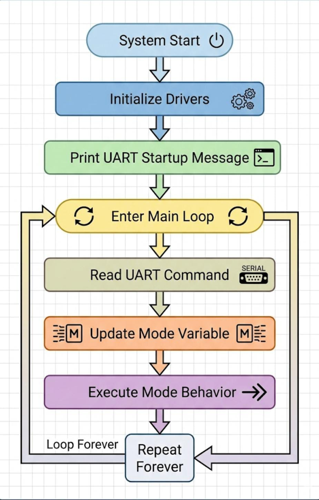

# Application Guide 
## UART-Controlled Mode Machine — VSDSquadron Mini (CH32V00x RISC-V)

---

## 1. Purpose
This document explains how the UART-Controlled Mode Machine application operates, how users interact with the system, and how the firmware behavior changes during execution. The guide is intended for engineers or users who want to understand, operate, or reuse the application without reviewing source code.

---

## 2. Application Overview
The UART-Controlled Mode Machine is an embedded firmware application that enables runtime control of an external LED connected to GPIO **PD4** using UART commands. The system behaves as a simple state machine where each state (mode) defines a unique LED operation pattern.

The application demonstrates real-time interaction between software and hardware using modular drivers for GPIO, UART, and Timer peripherals.

---

## 3. Operating Principle
The firmware continuously runs inside an infinite loop. During execution:

1. The system initializes UART communication and driver modules.
2. The application waits for user commands through the serial terminal.
3. A received command updates the current operating mode.
4. The LED behavior changes immediately according to the selected mode.
5. Status information is transmitted back through UART.

The system does not require resetting the board to change modes.

---

## 4. System Initialization Sequence
At power-up or reset, the application performs the following steps:

1. Updates system clock configuration.
2. Initializes timer delay subsystem.
3. Initializes UART communication at 115200 baud.
4. Configures GPIO PD4 as output for external LED control.
5. Prints startup information through UART.
6. Enters continuous execution loop.

---

## 5. Operating Modes
The application implements four operating modes. Each mode defines a different LED behavior.

| Mode | Description | LED Behavior |
|------|-------------|--------------|
| 0 | Idle Mode | LED remains OFF |
| 1 | Slow Blink Mode | LED toggles every 1000 ms |
| 2 | Fast Blink Mode | LED toggles every 200 ms |
| 3 | Active Mode | LED remains continuously ON |

Mode transitions occur immediately after receiving a valid command.

---

## 6. UART Command Interface

### Command Method
Commands are sent from a serial terminal connected to the board through USB-UART communication.

### Supported Commands

| Command | Action |
|---------|--------|
| `0` | Select Mode 0 (LED OFF) |
| `1` | Select Mode 1 (Slow Blink) |
| `2` | Select Mode 2 (Fast Blink) |
| `3` | Select Mode 3 (LED ON) |

Each command is interpreted as a single character input.

### Example Interaction

Task-4 Project-11 Ready
Mode = 1
Mode = 2
Mode = 3
Mode = 0

---

## 7. Runtime Behavior
During execution, the firmware repeatedly performs the following operations:

- Checks for UART input.
- Updates internal mode variable if a valid command is received.
- Executes LED control logic associated with the active mode.
- Applies timing delays using the Timer driver.
- Outputs status messages through UART.

This process ensures continuous responsiveness and predictable LED behavior.

---

## 8. Hardware Interaction
The application controls an external LED connected to GPIO **PD4** through the GPIO driver APIs.

### Electrical Operation
- GPIO HIGH → LED ON
- GPIO LOW → LED OFF
- Toggle operation creates blinking patterns.

The timing of blinking is controlled entirely through the Timer driver delay function.

---

## 9. Error Handling and Constraints
- Invalid UART inputs are ignored.
- Only numeric commands (`0–3`) modify system behavior.
- Delay functions are blocking; therefore, command responsiveness depends on current delay duration.
- The application is designed for demonstration and educational embedded use rather than multitasking environments.

---

## 10. Application Flow Diagram

---

## 11. Design Characteristics
The application demonstrates the following embedded design principles:

- Driver abstraction
- Layered firmware architecture
- Runtime configurability
- Deterministic timing behavior
- Hardware-independent application logic

---

## 12. Expected Outcome
When operated correctly:

- The system responds to UART commands immediately.
- LED behavior reflects the selected mode.
- UART logs confirm system state changes.
- The firmware runs continuously without reset.

---

## 13. Summary
The UART-Controlled Mode Machine application provides a clear example of integrating GPIO, UART, and Timer drivers into a structured embedded system. By separating application logic from hardware access and enabling runtime mode control, the design reflects industry-standard embedded firmware development practices suitable for scalable and reusable applications.
