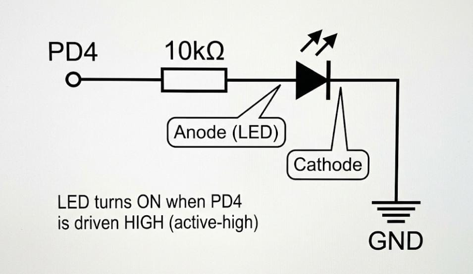

# System Architecture  
## UART-Controlled Mode Machine — VSDSquadron Mini

---

## 1. Overview

This document describes the architectural design of the **UART-Controlled Mode Machine** developed on the **VSDSquadron Mini (CH32V00x RISC-V)** platform.  
The firmware follows an **industry-standard layered embedded architecture**, separating application logic from hardware control through reusable driver APIs.

The system allows a user to control an external LED connected to **GPIO PD4** using UART commands. The architecture ensures modularity, maintainability, and driver reusability across embedded applications.

---

## 2. Architectural Design Goals

The firmware architecture was designed with the following objectives:

- Separation between application logic and hardware access
- Reusable peripheral drivers
- Clear data flow between system layers
- Easy debugging using UART logging
- Scalable structure for future peripherals (PWM, sensors, etc.)

---

## 3. High-Level Architecture

The system is divided into three logical layers:

---

## 4. Layer Description

### 4.1 Application Layer

**Location:** `src/main.c`

The application layer implements the system behavior and operating modes.  
It does not directly access hardware registers; instead, it uses driver APIs.

Responsibilities:
- Receive UART commands
- Maintain system mode state
- Control LED behavior
- Call driver APIs

Operating Modes:

| Mode | Behavior |
|------|----------|
| 0 | LED OFF |
| 1 | Slow Blink (1000 ms) |
| 2 | Fast Blink (200 ms) |
| 3 | LED ON |

---

### 4.2 Driver Layer

The driver layer abstracts low-level hardware operations and provides reusable APIs.

#### GPIO Driver
Responsible for digital pin control.

Functions:
- GPIO initialization
- Output control (set/clear/toggle)
- Input state reading

Used for:
- External LED control at PD4.

---

#### Timer Driver
Provides time delay functionality required for blinking patterns.

Functions:
- Timer initialization
- Millisecond delay generation

Used for:
- LED timing control.

---

#### UART Interface
Provides serial communication between the embedded system and host computer.

Functions:
- UART initialization
- Debug message transmission
- Command reception

Used for:
- Mode selection
- Runtime monitoring

---

### 4.3 Hardware Layer

Physical components connected to the microcontroller:

- VSDSquadron Mini board (CH32V00x MCU)
- External red LED
- 10kΩ resistor
- Breadboard
- Jumper wires
- USB interface (power + UART)

---

## 5. Data Flow

### 5.1 Mode Variable
- `mode` is an integer in the application layer.
- Valid values: `0, 1, 2, 3`
- Updated via UART command input.

### 5.2 Driver API Boundary
The driver layer provides a stable boundary so that the application does not depend on hardware registers. This improves reuse and portability.

Example boundary usage:
- Application calls `gpio_toggle(PD4)` instead of manipulating output registers.
- Application calls `timer_delay_ms(200)` instead of directly implementing delay loops.

---

## 6. External LED Hardware Interface (PD4)

### Circuit Summary
An external LED is connected to **PD4** using a series resistor.

Notes:
- LED turns ON when PD4 is driven HIGH (active-high configuration).
- Breadboard and jumper wires are used for connection.

---

## 7. Design Rationale (Why This Architecture)
This architecture is used to achieve:
- **Modularity:** Drivers and application are separated.
- **Reusability:** GPIO/Timer APIs can be reused in future tasks/projects.
- **Maintainability:** Changes in hardware control remain inside drivers.
- **Testability:** UART logs provide observable evidence of runtime behavior.
- **Industry alignment:** The structure matches common embedded firmware layering.

---

## 8. Summary
The UART-Controlled Mode Machine is implemented using a layered design approach where the application logic controls system modes and uses reusable GPIO and Timer driver APIs. UART serves as a command and logging interface. The resulting system is simple, reliable, and structured to match industry-standard embedded firmware practices.
