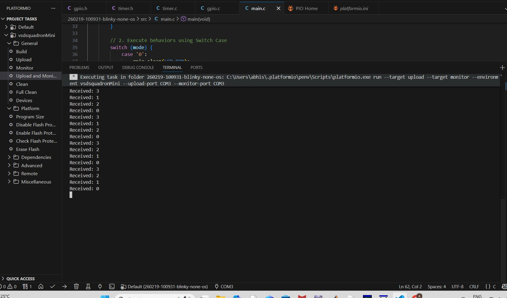

# Demo Guide (Industry-Standard Documentation)
## UART-Controlled Mode Machine — VSDSquadron Mini (CH32V00x RISC-V)

---

## 1. Purpose
This document provides step-by-step instructions to run and verify the UART-Controlled Mode Machine application. The guide is designed so that a reviewer or engineer can reproduce the complete demonstration within five minutes using the provided firmware and hardware setup.

---

## 2. Required Hardware

### Development Board
- VSDSquadron Mini (CH32V00x RISC-V)

### External Components
- 1 × Red LED
- 1 × 10kΩ resistor
- Breadboard
- Jumper wires
- USB cable (power + UART communication)

---

## 3. Circuit Connection

The external LED is connected to GPIO **PD4**.

### Connection Notes
- PD4 drives the LED in active-high configuration.
- LED turns ON when PD4 output is HIGH.
- Ensure proper polarity of the LED.

---

## 4. Software Requirements
- Visual Studio Code
- PlatformIO Extension
- USB Serial Driver (auto-installed in most systems)

---

## 5. Flashing Procedure

Follow the steps below to program the board:

1. Open the project in **VS Code using PlatformIO**.
2. Connect the VSDSquadron Mini board via USB.
3. Ensure firmware source is located in `src/main.c`.
4. Click **Build** to compile the firmware.
5. Click **Upload** to flash the firmware onto the board.
6. Wait until upload shows **SUCCESS** in the terminal.

---

## 6. UART Settings

Open PlatformIO Serial Monitor with the following configuration:

| Parameter | Value |
|-----------|-------|
| Baud Rate | 115200 |
| Data Bits | 8 |
| Parity | None |
| Stop Bits | 1 |
| Flow Control | None |

---

## 7. Running the Demonstration

After flashing:

1. Open **Serial Monitor**.
2. Reset the board once (if startup message is not visible).
3. Observe startup message printed on terminal.
4. Type commands listed below and press **Enter**.

---

## 8. Commands to Type

| Command | Function |
|---------|----------|
| `0` | LED OFF |
| `1` | Slow Blink Mode |
| `2` | Fast Blink Mode |
| `3` | LED ON |

Commands are single numeric inputs.

---

## 9. Expected UART Output

Example serial monitor output:

The exact order depends on user commands.

---

## 10. Hardware Verification (What Reviewer Should Observe)

The reviewer should confirm the following behaviors:

| Mode | Hardware Observation |
|------|----------------------|
| 0 | External LED remains OFF |
| 1 | LED blinks slowly (~1 second interval) |
| 2 | LED blinks rapidly (~200 ms interval) |
| 3 | LED remains continuously ON |

Additional verification:
- LED behavior changes immediately after command entry.
- No system reset occurs during mode switching.
- UART messages confirm mode updates.

---

## 11. Verification Checklist

The demo is considered successful if:

- Firmware flashes successfully.
- UART startup message appears.
- Commands change LED behavior correctly.
- LED responds in real time.
- System runs continuously without crash or reset.

---

## 12. Conclusion
Following this guide allows rapid reproduction of the UART-Controlled Mode Machine demonstration. The successful execution validates proper integration of GPIO, UART, and Timer drivers and confirms correct embedded system behavior on the VSDSquadron Mini platform.
