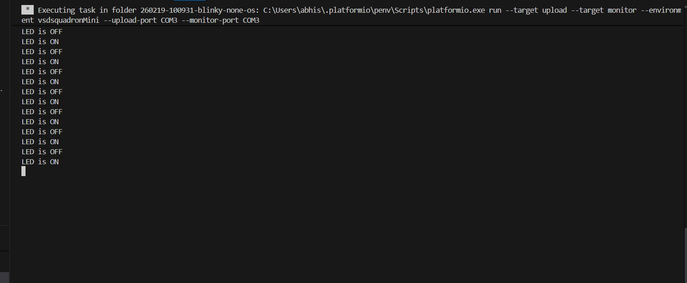
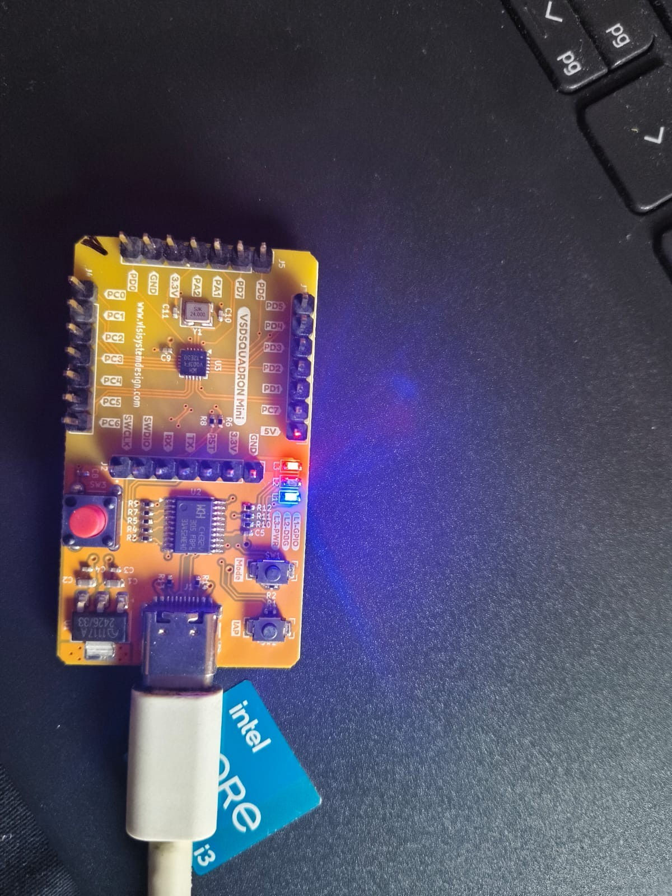

# Task 2 – Evidence

## UART Evidence
- UART message printed repeatedly
- Verified using PlatformIO serial monitor

### Screenshot

### Video
Link: (paste Google Drive / YouTube link)

---

## GPIO Evidence

- **Physical Board Pin:** GPIO-L1  
- **Firmware GPIO:** GPIOD, Pin 6  
- **Connected Peripheral:** On-board LED  

### Verification Method
The GPIO-L1 pin was configured as an output and toggled every 1 second in firmware.
The visible blinking of the on-board LED confirms correct GPIO functionality.

### Evidence
- Photo showing VSDSquadron Mini board with blinking LED
- Short video demonstrating continuous LED toggling

### Photo

### Video
(gpio2.mp4)

