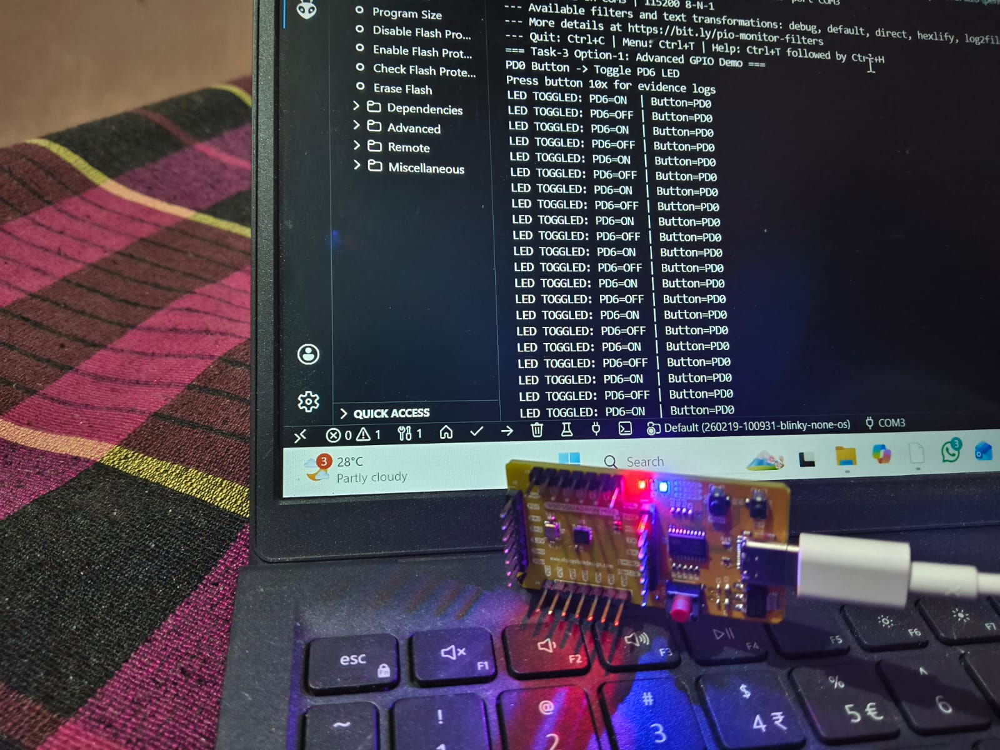

# Task 3 – Evidence  
## Peripheral Driver Library Development (Option 1)

This document provides evidence for the successful completion of **Task 3 (Option 1)**, which focuses on developing a GPIO driver library and demonstrating its usage through an application.

---

## 1. GPIO Driver Library Verification

### Description  
A GPIO driver library was developed to abstract all hardware-specific GPIO operations.  
The driver provides clean and reusable APIs for initializing and controlling GPIO pins.

All low-level operations such as clock enabling and pin configuration are handled inside the GPIO library files (`gpio.c` and `gpio.h`).

---

## 2. Application Demonstration

### Description  
The application (`main.c`) uses only the GPIO driver APIs and does not directly access any hardware registers or GPIO configuration functions.

The application toggles the on-board LED at a fixed interval to demonstrate correct interaction between the application layer and the GPIO driver library.

---

## 3. Hardware Details

- **Board:** VSDSquadron Mini  
- **Physical Pin Used:** GPIO-L1  
- **Firmware Mapping:** GPIOD, Pin 6  
- **Peripheral Controlled:** On-board LED  

---

## 4. Verification Method

- The GPIO driver initializes GPIO-L1 as an output.
- The application calls the GPIO driver toggle function periodically.
- The on-board LED visibly blinks at a regular interval.
- This confirms:
  - Correct GPIO driver implementation  
  - Proper abstraction between driver and application layers  

---

## 5. Evidence Captured

### Photo Evidence

- Photograph showing the VSDSquadron Mini board with the on-board LED blinking.

### Video Evidence
(task3.mp4)
- A Short video demonstrating continuous LED toggling using the GPIO driver library.

---

## 6. Conclusion

The successful blinking of the on-board LED using only GPIO driver APIs confirms that the GPIO peripheral driver library is functioning correctly.  
This validates the objectives of Task 3 by demonstrating proper driver abstraction, modular design, and correct hardware behavior.
